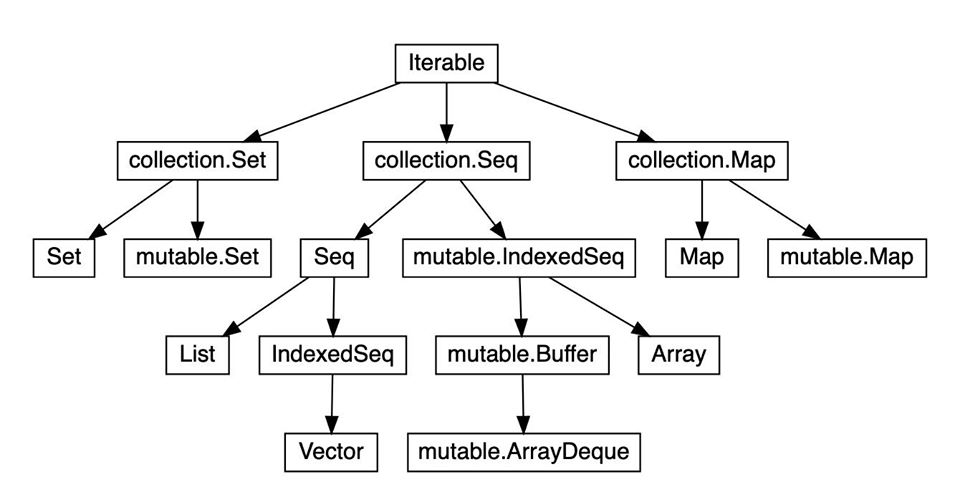

# Utility_Scala
> Introduction of `Scala programming language` as well as `Spark Scala` via couples of basic scripts in common use cases. Please check the [Main files](https://github.com/yennanliu/utility_Scala#main-files) for more information.

- [Scala cheatsheets](https://docs.scala-lang.org/cheatsheets/)
- [Scala learn material](https://github.com/yennanliu/utility_Scala/#scala-learn-material)
- [Scala/Spark Ref](https://github.com/yennanliu/utility_Scala/#Ref)

<p align="center"></p>

<p align="center"></p>


## Scala Projects 
* [spark_emr_dev](https://github.com/yennanliu/spark_emr_dev) - Demo of submitting Hadoop ecosystem jobs to AWS EMR
* [spark-etl-pipeline](https://github.com/yennanliu/spark-etl-pipeline) - Demo of various Spark ETL processes
* [utility_Scala](https://github.com/yennanliu/utility_Scala) - Scala/Spark programming basic demo 

## Main Files
1. [Utility Scala](https://github.com/yennanliu/utility_Scala/tree/master/src/main/scala/UtilityScala) - Scala scripts for utility
2. [Spark Scala Demo](https://github.com/yennanliu/utility_Scala/tree/master/src/main/scala/SparkDemo)  - Scala spark basic demo
3. Scala basic  -  variable, data structure
	- [Scala_basic_demo_3](./src/main/scala/ScalaBasic/scala_basic_demo_3.scala) - Scala basic data structrue : `array, list, tuple`, apply `function, lambda` with them basic. And `map, exception` demo
	- [Array](./src/main/scala/ScalaBasic/ScalaArrayDemo.scala) - Scala `Array` basic op, properties
	- [ListDemo_1](./src/main/scala/ScalaBasic/ListDemo_1.scala), [Scala_yield_to_List](./src/main/scala/ScalaBasic/Scala_yield_to_List.scala) - Scala Lists are quite similar to arrays, which means all the elements of a list have the same type - but there are two important differences.
		- First, lists are immutable, which means elements of a list cannot be changed by assignment. 
		- Second, lists represent a `linked list` whereas arrays are flat. The `type of a list` that has elements of `type T` is written as List[T].
	- [HashMap](./src/main/scala/ScalaBasic/ScalaHashMap.scala) - Scala `Hash Map` basic op, properties
	- [MapDemo_1](./src/main/scala/ScalaBasic/MapDemo_1.scala) - Scala `Map` basic op, properties
	- [Enumeration](./src/main/scala/ScalaBasic/EnumerationDemo.scala) - Scala `Enumeration` basic op, properties
	- [Nothing_demo1](./src/main/scala/ScalaBasic/Nothing_demo1.scala), [Nothing_demo2](./src/main/scala/ScalaBasic/Nothing_demo2.scala) - `Nothing` can still pass information when the program failed. null can be passed to AnyRef, but NOT AnyValue (AnyValue : Int, Float, Char, Boolean, Long, Double, Byte, short...)

4. Scala basic  -  function, class, case class, constructor...
	- [ScalaIfElseMatchForloop](./src/main/scala/ScalaBasic/ScalaIfElseMatchForloop.scala) - Scala `if, else, while, match` basic 
	- [ScalaFunction_1](./src/main/scala/ScalaBasic/ScalaFunction_1.scala) - Scala `function, lambda` basic
	- [ScalaFunction_2](./src/main/scala/ScalaBasic/ScalaFunction_2.scala) - Scala `function with dynamic var length` 
	- [Scala_basic_demo_4](./src/main/scala/ScalaBasic/scala_basic_demo_4.scala) - Scala `try, exception`, `error handling` demo
	- [ScalaFileIODemo](./src/main/scala/ScalaBasic/ScalaFileIODemo.scala), [ScalaFileIODemo2](./src/main/scala/ScalaBasic/ScalaFileIODemo2.scala),  [ScalaFileIODemo3](./src/main/scala/ScalaBasic/ScalaFileIODemo3.scala) - Scala file IO basic
	- [ScalaLazyDemo](./src/main/scala/ScalaBasic/LazyDemo.scala) - Scala lazy value demo
	- [ScalaUnitDemo](./src/main/scala/ScalaBasic/UnitDemo.scala) - Scala function with `no return value` called as `procedure`, with return type `Unit`
	- [Class](./src/main/scala/ScalaBasic/ScalaClassDemo.scala) - Scala `class` basic op, properties
	- [Case Class](./src/main/scala/ScalaBasic/CaseClass.scala), [Case Class2](./src/main/scala/ScalaBasic/CaseClass2.scala) - Scala `class` basic op, properties
	- [OverrideDemo](./src/main/scala/ScalaBasic/OverrideDemo.scala) - Scala `Override` basic op, properties
	- [HigherOrderfuncDemo](./src/main/scala/ScalaBasic/HigherOrderfuncDemo.scala), [HigherOrderFuncDemo_2](./src/main/scala/ScalaBasic/HigherOrderFuncDemo_2.scala), [HigherOrderFuncDemo_3](./src/main/scala/ScalaBasic/HigherOrderFuncDemo_3.scala), [HigherOrderFuncDemo_4](./src/main/scala/ScalaBasic/HigherOrderFuncDemo_4.scala), [HigherOrderFuncDemo_5](./src/main/scala/ScalaBasic/HigherOrderFuncDemo_5.scala)- `Higher Order Functions` are functions that take functions as arguments and/or return functions.
	- [RecursionDemo](./src/main/scala/ScalaBasic/RecursionDemo.scala) - Scala `Recursion` basic op, properties
	- [ConstructorDemo](./src/main/scala/ScalaBasic/ConstructorDemo.scala) - Scala `Constructor` basic op, properties
	- [PatternmatchDemo](./src/main/scala/ScalaBasic/PatternmatchDemo.scala), [PatternmatchDemo2](./src/main/scala/ScalaBasic/PatternmatchDemo2.scala), [PatternmatchDemo3](./src/main/scala/ScalaBasic/PatternmatchDemo3.scala), [PatternmatchValueCompare](./src/main/scala/ScalaBasic/PatternmatchValueCompare.scala) - Scala `Pattern match` basic op, properties
	- [thisDemo](./src/main/scala/ScalaBasic/thisDemo.scala) - Scala `this` basic op, properties
	- [SomeDemo](./src/main/scala/ScalaBasic/SomeDemo.scala) - Scala `Some` basic op, properties
	- [CaseHeadTailNil](./src/main/scala/ScalaBasic/CaseHeadTailNil.scala) - Scala `Case on List Head Tail Nil` basic op, properties
	- [GenericTypeParam](./src/main/scala/ScalaBasic/GenericTypeParam.scala) - Scala `Generic Type` basic op, properties,
	e.g. : ``` def exec[T](f: () => T): T = {f()}```
	- [TryGetOrElse](./src/main/scala/ScalaBasic/TryGetOrElse.scala), [TryGetOrElse2](./src/main/scala/ScalaBasic/TryGetOrElse2.scala) - Scala `try GetOrElse(else)` example
	- [UpperCass](./src/main/scala/ScalaBasic/UpperCass.scala) - Scala `UpperCass ( <: )` basic op, properties
	- [Find](./src/main/scala/ScalaBasic/Find.scala) - Scala `Find`, `exists`,  `contains`, and `isDefined` examples
	- [Partial applied functions demo 1](./src/main/scala/ScalaBasic/PartialAppliedFuncDemo_1.scala) - Scala Partial applied functions examples
	- [Partial functions demo 1](./src/main/scala/ScalaBasic/partial_functions_demo_1.scala) - Scala Partial functions examples

5. Scala class, trait, abstract class..

	- [Trait](./src/main/scala/ScalaBasic/TraitDemo.scala), [TraitAbstract](./src/main/scala/ScalaBasic/TraitAbstract.scala), [TraitDemo2](./src/main/scala/ScalaBasic/TraitDemo2.scala), [TraitAsInterface](./src/main/scala/ScalaBasic/TraitAsInterface.scala) - Scala `TraitDemo`, `Trait Abstract` basic op, properties. *NOTICE* : `Scala traits don’t allow constructor parameters` (so that's why we use abstract class)
	- [Abstract Class](./src/main/scala/ScalaBasic/AbstractClass.scala), [AbstractDemo](./src/main/scala/ScalaBasic/AbstractDemo.scala) - Scala also has a concept of an abstract class that is similar to Java’s abstract class. But because traits are so powerful, you rarely need to use an abstract class. In fact, you only need to use an abstract class when:
		- You want to create a base class that requires constructor arguments
	    - Your Scala code will be called from Java code
	- [Class VS Object 1](./src/main/scala/ScalaBasic/Class_VS_Object_1.scala), [Class VS Object 2](./src/main/scala/ScalaBasic/Class_VS_Object_2.scala) - Compare Class, object difference, feature in Scala
	- [Type Parameterlization Demo1](./src/main/scala/ScalaBasic/TypeParameterlizationDemo_1.scala) - Type Parameterlization in Scala
	- [CompanionDemo1](./src/main/scala/ScalaBasic/CompanionDemo1.scala), [CompanionDemo2](./src/main/scala/ScalaBasic/CompanionDemo2.scala)  - Scala Companion demo (An object that has the same name as a class is called a companion object of the class, and it is often used to contain factory methods for the class that it complements)
	- [Apply method demo 1](./src/main/scala/ScalaBasic/ApplyMethodDemo1.scala), [Apply method demo 2](./src/main/scala/ScalaBasic/ApplyMethodDemo2.scala),  [Apply method demo 3](./src/main/scala/ScalaBasic/ApplyMethodDemo3.scala) - if we have 1 object : `Object(param1, param2...)` then we will get the `Companion class` object return via the `Apply` method


5. Scala implicit
	- [implicit_transformation_demo_1](./src/main/scala/ScalaBasic/implicit_transformation_demo_1.scala), [implicit_transformation_demo_2](./src/main/scala/ScalaBasic/implicit_transformation_demo_2.scala) - implicit transformation can automatically transform "high accuracy" val to "low accuracy". e.g. : Byte -> Short, Short -> Int, Int -> Long, Long -> Float, Char -> Int ..
	- [ImplicitParameters](./src/main/scala/ScalaBasic/ImplicitParameters.scala), [ImplicitFunc](./src/main/scala/ScalaBasic/ImplicitFunc.scala), [ImplicitClass](./src/main/scala/ScalaBasic/ImplicitClass.scala) - Scala `implicit` in Parameters, func, class 

6. Scala Script example
	- [DecoratorDesignPattern](./src/main/scala/ScalaBasic/DecoratorDesignPattern.scala) - Scala `Decorator Design Pattern` example
	- [DirectoryOP](./src/main/scala/ScalaBasic/DirectoryOP.scala) - Scala `Directory OP` example

7. Spark basic
	- [Spark_basic_demo_1](./src/main/scala/SparkBasic/spark_basic_demo_1.scala) - Spark `function `basic demo
	- [Spark_basic_demo_2](./src/main/scala/SparkBasic/spark_basic_demo_2.scala) - Spark `RDD basic op` demo : count avg friends by age
		- [Spark_basic_demo_2 extra](./src/main/scala/SparkBasic/spark_basic_demo_2_extra.scala) - Extra : count avg friend by first name
	- [Spark_basic_demo_3](./src/main/scala/SparkBasic/spark_basic_demo_3.scala) - Spark `RDD filter` demo : min temp on each station (weather data)
	- [Spark_basic_demo_4](./src/main/scala/SparkBasic/spark_basic_demo_4.scala) - Spark `RDD flatMap` demo : word count (book data)
		- [Spark_basic_demo_4 extra](./src/main/scala/SparkBasic/spark_basic_demo_4_extra.scala) - Extra : word count with `regular expression` preprocess
	- [PopularMoviesNicer](./src/main/scala/SparkBasic/PopularMoviesNicer.scala) - Spark `broadcast` demo :  movie-lens data (ml-100k)
	- [MostPopularSuperhero](./src/main/scala/SparkBasic/MostPopularSuperhero.scala) - `Lookup` values from `RDD` and `map them to another RDD`, and options method in Spark
	- [DegreesOfSeparation](./src/main/scala/SparkBasic/DegreesOfSeparation.scala) - Code `BFS (Breadth-first search)`from scratch via spark 
	- [MovieSimilarities](./src/main/scala/SparkBasic/MovieSimilarities.scala) - Code the `Collaborative filtering (CF)` (item based) from scratch via Spark 
	- [SparkSQL](./src/main/scala/SparkBasic/SparkSQL.scala) - Spark SQL basic
	- [DataFrames](./src/main/scala/SparkBasic/DataFrames.scala) - Spark `Dataset`, a important feature when in Spark-2.0/SparkMlib/Spark-stream
	- [PopularMoviesDataSets](./src/main/scala/SparkBasic/PopularMoviesDataSets.scala) - Do the popular movie computation again via the `Spark datasets` 
		- [PopularMovies](./src/main/scala/SparkBasic/PopularMovies.scala) - Original popular movie approach via Spark RDD
	- [GraphX](./src/main/scala/SparkBasic/GraphX.scala) - Spark `GraphX` demo : compute the social network degree for the marvel heros

## Quick Start

<details>
<summary> Quick start manually</summary>

```bash

# DEMO 1) run scala hello world 
$ git clone https://github.com/yennanliu/utility_Scala.git
$ cd utility_Scala
$ scala src/main/scala/UtilityScala/HelloWorld.scala 
#$ Hello World


# DEMO 2) run scala spark hello world via sbt 
$ cd utility_Scala
$ sbt package
$ sbt
# inside sbt console
sbt:Simple Project> run 
# [warn] Multiple main classes detected.  Run 'show discoveredMainClasses' to see the list

# Multiple main classes detected, select one to run:

#  [1] AnonymousFuncDemo
#  [2] ClassDemo
#  [3] FileIODemo
#  [4] ForLoopDemo
#  [5] FunctionChangeableParameterDemo
#  [6] FunctionCompositionDemo
#  [7] HelloWorld
#  [8] IfElseDemo
#  [9] OperatorDemo
#  [10] PatterMatchDemo
#  [11] SimpleApp
#  [12] Test
#  [13] UderDefinedDefaultParamFuncDemo
#  [14] UderDefinedFuncDemo

Enter number: 11

# [info] Running SimpleApp 
# ...
#  >>>>>>>>>>>>>> OUTPUT
# Lines with a: 21, Lines with b: 9
#  >>>>>>>>>>>>>> OUTPUT
# ...

# DEMO 3) run scala spark hello world
$ cd utility_Scala
$ sbt clean compile && sbt assembly 
$ spark-submit \
  --class "SimpleApp" \
  --master local[4] \
  target/scala-2.11/simple-project_2.11-1.0.jar

```

```bash
# REPL via sbt console
$ sbt
console
scala> 

# ✘ yennanliu@MacBook-Pro  ~/utility_Scala   master ●  
# ✘ yennanliu@MacBook-Pro  ~/utility_Scala   master ●  sbt  
# [info] Loading settings for project utility_scala-build from plugins.sbt ...
# [info] Loading project definition from /Users/yennanliu/utility_Scala/project
# [info] Loading settings for project utility_scala from build.sbt ...
# [info] Set current project to UtilityScala (in build file:/Users/yennanliu/utility_Scala/)
# [info] sbt server started at local:///Users/yennanliu/.sbt/1.0/server/ff2f518f2235c5fb0743/sock
# sbt:UtilityScala> console
# [info] Starting scala interpreter...
# Welcome to Scala 2.11.8 (OpenJDK 64-Bit Server VM, Java 1.8.0_252).
# Type in expressions for evaluation. Or try :help.

# scala> import slick.driver.H2Driver.api._
# import slick.driver.H2Driver.api._

# scala> 

```
</details>

<details>
<summary> Quick start via Docker</summary>

```bash
$ git clone https://github.com/yennanliu/utility_Scala.git
$ cd utility_Scala
$ docker build . -t spark_env
$ docker run  --mount \
type=bind,\
source="$(pwd)"/.,\
target=/utility_Scala \
-i -t spark_env \
/bin/bash

```
</details>

<details>
<summary> Quick start via `Spark-submit`</summary>

```bash
# package the scala saprk scripts
$ sbt package
# list the current classes
$ ls target/scala-2.11/classes
# run ForLoopDemo
$ spark-submit \
  --class ForLoopDemo \
  target/scala-2.11/utilityscala_2.11-1.0.jar 
# run LambdaFuncDemo
$ spark-submit \
  --class LambdaFuncDemo \
  target/scala-2.11/utilityscala_2.11-1.0.jar 
# run spark_basic_demo_4
$ spark-submit \
  --class SparkBasic.spark_basic_demo_4 \
  target/scala-2.11/utilityscala_2.11-1.0.jar
# run MovieSimilarities
$ spark-submit \
  --class SparkBasic.MovieSimilarities \
  target/scala-2.11/utilityscala_2.11-1.0.jar 50 

```

</details>

## Development 

- Trouble shooting 
	- if facing `Origin location must be absolute error in building a SBT project` like [errors](./doc/origin_location_must_be_absolute_error.txt) when sbt build (`sbt package`), try to clean the sbt cache via `rm -fr ~/.ivy2` (remove entire .ivy2 file), then build the project again
	- https://www.scala-sbt.org/1.x/docs/Dependency-Management-Flow.html

- Clean cache (sbt) : in case when there is issue build the project via IntelliJ sbt
```bash
ls -al
rm .idea
```

## scala-learn-material

<details>
<summary>scala-learn-material</summary>

- Scala Tutorial  
	- https://docs.scala-lang.org/tour/basics.html
	- https://www.handsonscala.com/index.html
	- https://github.com/handsonscala/handsonscala
	- https://www.javatpoint.com/scala-tutorial
	- https://www.tutorialspoint.com/scala/
	- http://www.runoob.com/scala/scala-basic-syntax.html
	- https://ithelp.ithome.com.tw/users/20107343/ironman/1301?page=1

- Tour on Scala
	- https://docs.scala-lang.org/tour/tour-of-scala.html

- Scala Stadard Library API
	- https://www.scala-lang.org/api/current/

- Scala on stackoverflow
	- https://stackoverflow.com/tags/scala/info

- Scala Quick Ref
	- https://courseware.epfl.ch/courses/course-v1:EPFL+progfun2+2018_T1/6c4ec266ee24467c9745009ba131f3da/

- Scala books
	- https://github.com/yennanliu/data_science_repo/tree/master/book/scala

- Scala trait intro
	- https://docs.scala-lang.org/overviews/scala-book/traits-intro.html

</details>

## Ref 

<details>
<summary>Ref</summary>

- Scala `Regular Expression`
	- https://www.tutorialspoint.com/scala/scala_regular_expressions.htm
	- https://www.geeksforgeeks.org/regular-expressions-in-scala/

- Build Scala Spark project with sbt 
	- http://xd-deng.com/render_html/step_by_step_to_package_spark_app_scala.html

- sbt manual 
	- https://www.scala-sbt.org/1.x/docs/index.html

- Write test for Scala
	- https://www.scalatest.org/

- scala test 
	- http://www.scalatest.org/user_guide/using_scalatest_with_sbt

- Scala spark source code tutorial  
	 - https://github.com/lw-lin/CoolplaySpark

- Kafka with scala spark demo 
	- https://github.com/spirom/spark-streaming-with-kafka

- Spark scala test 
	- http://mkuthan.github.io/blog/2015/03/01/spark-unit-testing/

- Spark scala tutorial 
	- http://allaboutscala.com/big-data/spark/

- Scala DB client API
	- http://scala-slick.org/doc/3.0.0/introduction.html
	- https://www.playframework.com/documentation/2.7.x/ScalaDatabase

</details>
