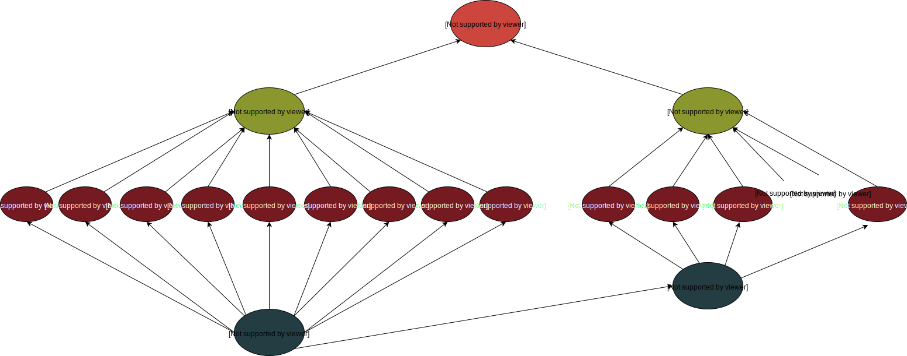
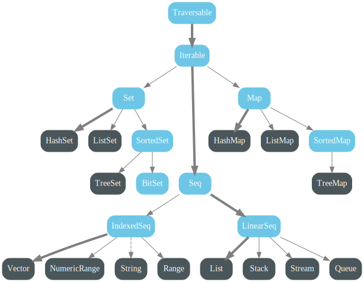
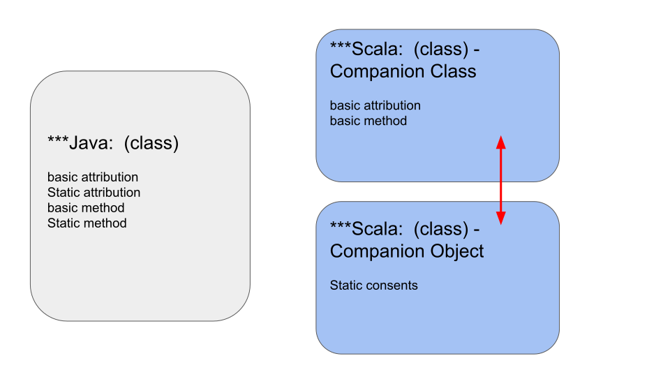
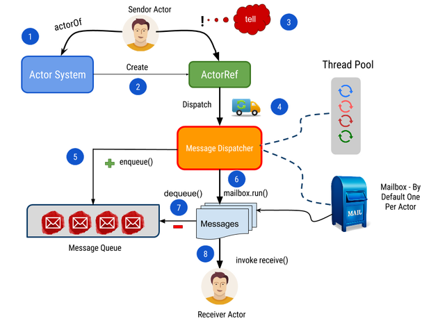

# Utility_Scala
> Introduction of `Scala programming language` as well as `Spark Scala` via couples of basic scripts in common use cases. Please check the [Main files](https://github.com/yennanliu/utility_Scala#main-files) for more information.

- [Scala cheatsheets](https://docs.scala-lang.org/cheatsheets/)
- [Scala learn material](https://github.com/yennanliu/utility_Scala/#scala-learn-material)
- [Scala/Spark Ref](https://github.com/yennanliu/utility_Scala/#Ref)
- [Scala mutable/immutable collection map](https://docs.scala-lang.org/tutorials/FAQ/collections.html)


### General dtype
<p align="center"></p>


### Immutable
<p align="center"></p>


### mutable
<p align="center"></p>


## Scala Projects
* [Scala Coursera](https://github.com/yennanliu/ScalaCoursera) - My note/code for Coursera Scala series class
* [spark_emr_dev](https://github.com/yennanliu/spark_emr_dev) - Demo of submitting Hadoop ecosystem jobs to AWS EMR
* [spark-etl-pipeline](https://github.com/yennanliu/spark-etl-pipeline) - Demo of various Spark ETL processes
* [utility_Scala](https://github.com/yennanliu/utility_Scala) - Scala/Spark programming basic demo 

## Note
* [Scala Note](https://github.com/yennanliu/utility_Scala/tree/master/doc/scala_note.md) - Scala learning note

## Main Files
1. [Utility Scala](https://github.com/yennanliu/utility_Scala/tree/master/src/main/scala/UtilityScala) - Scala scripts for utility

2. [Spark Scala Demo](https://github.com/yennanliu/utility_Scala/tree/master/src/main/scala/SparkDemo)  - Scala spark basic demo

3. Scala basic  -  variable, data structure
	- [Scala_basic_demo_3](./src/main/scala/ScalaBasic/scala_basic_demo_3.scala) - Scala basic data structrue : `array, list, tuple`, apply `function, lambda` with them basic. And `map, exception` demo
	- Immutable & mutable
		- UNCHANGED : Immutable
			- example : `scala.collection.Immutable`
			- Scala has some Immutable class that java already has
				- e.g. : Set, Map
			- however, Scala has its own unique Immutable class
				- e.g. Seq
			- immutable.Seq.LinearSeq uses a lot : Queue, Stack ...
			- `string` belongs to immutable.Seq.IndexedSeq
			- there is a SortedMap under Map offering "ordering" feature
		- CAN CHANGED : mutable
			- example : `scala.collection.mutable`
		- Scala uses "immutable" by default
		- For most of the data structure, Scala offers both `immutable` and `mutable` versions
	- Array
		- `immutable` array
		- [ArrScalaArrayDemoay](./src/main/scala/ScalaBasic/ScalaArrayDemo.scala)
		- [ArrayDemo1](./src/main/scala/ScalaBasic/ArrayDemo1.scala)
		- [ArrayDemo2](./src/main/scala/ScalaBasic/ArrayDemo2.scala)
		- Scala `Array` basic op, properties
	- ArrayBuffer
		- `mutable` array, similar as `ArrayList` in java
		- [ArrayBufferDemo1](./src/main/scala/ScalaBasic/ArrayBufferDemo1.scala)
	- Array <--> ArrayBuffer
		- [ArrayToArrayBufferDemo1](./src/main/scala/ScalaBasic/ArrayToArrayBufferDemo1.scala)
	- ArrayBuffer <--> Java List
		- [ArrayBufferToJavaList1](./src/main/scala/ScalaBasic/ArrayBufferToJavaList1.scala)
	- Dimension Array
		- Array with N-dimension
		- [DimensionArray1](./src/main/scala/ScalaBasic/DimensionArray1.scala)
	- Tuple
		- [TupleDemo1](./src/main/scala/ScalaBasic/TupleDemo1.scala)
		- can be recognized as a "container"
		- can save various elements with `different/same type`
		- tuple can only save `22 elements as MAX`
	- List
		- [ListDemo_1](./src/main/scala/ScalaBasic/ListDemo_1.scala)
		- [ListDemo_2](./src/main/scala/ScalaBasic/ListDemo_2.scala)
		- [ListDemo_3](./src/main/scala/ScalaBasic/ListDemo_3.scala)
		- [Scala_yield_to_List](./src/main/scala/ScalaBasic/Scala_yield_to_List.scala) 
		- Scala list `can storage data` directly (a object); while in Java, list is an interface, the implementation is `ArrayList`
		- scala list can save `any` type of elements 
		- if want to get a `null list` -> use `Nil` (e.g. `val list2 = Nil`)
		- Scala Lists are quite similar to arrays, which means all the elements of a list have the same type - but there are two important differences.
		- list are immutable, which means elements of a list cannot be changed by assignment.
		- By default, Scala List is `immutable` (unchanged)
		- list is ordering (order matters)
		- list adding element :
		```scala
		val list_1 = List(1,2,4,"xxx")
		val list_2 = list_1 :+ 4
		```
		- [ListDemo_4](./src/main/scala/ScalaBasic/ListDemo_4.scala)
		- [ListDemo_5](./src/main/scala/ScalaBasic/ListDemo_5.scala)
		- list adding element via `::`, `:::`:
			- `::` means adding new element to a list
			- we must put the list on the `right` of `::`. (i.e. 4 :: list_1)
			- computing ordering : `from right to list`
			- `:::` means add `EVERY` element in list to a `null` list
			- we must put the list on the `right and left` of `:::`. (i.e. list_1 ::: list_2 ::: list_3)
		- list represents a `linked list` whereas arrays are flat. The `type of a list` that has elements of `type T` is written as List[T].
	- Queue
		- [QueueDemo1](./src/main/scala/ScalaBasic/QueueDemo1.scala)
		- [QueueDemo2](./src/main/scala/ScalaBasic/QueueDemo2.scala)
	- Map
		- Map
			- [MapDemo_1](./src/main/scala/ScalaBasic/MapDemo_1.scala)
			- [MapDemo_2](./src/main/scala/ScalaBasic/MapDemo_2.scala)
			- [MapDemo_3](./src/main/scala/ScalaBasic/MapDemo_3.scala)
			- [MapDemo_4](./src/main/scala/ScalaBasic/MapDemo_4.scala)
			- [MapDemo_5](./src/main/scala/ScalaBasic/MapDemo_5.scala)
			- [MapDemo_6](./src/main/scala/ScalaBasic/MapDemo_6.scala) : map get values demo
			- [JavaMap1](./src/main/scala/ScalaBasic/JavaMap1.java) : java Map demo
			- Scala `Map` basic op, properties
		- HashMap
			- [HashMap](./src/main/scala/ScalaBasic/ScalaHashMap.scala) 
			- Scala `Hash Map` basic op, properties
	- Set
		- `collection of unique elements`, no ordering, default is hashmap's implementation
		- Set is `immuatable` default in Scala, if want mutable, need import `scala.collection.mutable.set`
		- [SetDemo_1](./src/main/scala/ScalaBasic/SetDemo_1.scala)
		- [SetDemo_2](./src/main/scala/ScalaBasic/SetDemo_2.scala)
		- [SetDemo_3](./src/main/scala/ScalaBasic/SetDemo_3.scala)
		- [JavaSetDemo_1](./src/main/scala/ScalaBasic/JavaSetDemo_1.java)
	- Stream
		- stream is one kind of the collection that can storgae `unlimit` elements. However, the unlimit elements are not showed up at once, but with dynamic space, the last element in stream following the `lazy` style (only computed when called)
		- [StreamDemo_1](./src/main/scala/ScalaBasic/StreamDemo_1.scala)

4. Scala basic  -  operation
	- map (op)
		- [mapOPDemo_1](src/main/scala/ScalaBasic/mapOpDemo_1.scala)
		- [mapOpDemo_2](src/main/scala/ScalaBasic/mapOpDemo_2.scala)
	- FlatMap
		- flatMap will go to `every sub group` in a group and map the operation on each of them then return the result
		- [FlatMapDemo_1](./src/main/scala/ScalaBasic/FlatMapDemo_1.scala)
	- Filter
		- [Filter_demo1](./src/main/scala/ScalaBasic/Filter_demo1.scala)
	- Reduce
		- [Reduce_demo1](./src/main/scala/ScalaBasic/Reduce_demo1.scala)
	- Fold
		- [Fold_demo1](./src/main/scala/ScalaBasic/Fold_demo1.scala)
	- [Enumeration](./src/main/scala/ScalaBasic/EnumerationDemo.scala) - Scala `Enumeration` basic op, properties
	- [Nothing_demo1](./src/main/scala/ScalaBasic/Nothing_demo1.scala), [Nothing_demo2](./src/main/scala/ScalaBasic/Nothing_demo2.scala) - `Nothing` can still pass information when the program failed. null can be passed to AnyRef, but NOT AnyValue (AnyValue : Int, Float, Char, Boolean, Long, Double, Byte, short...)
	- Either, Left, Right
		- [EitherLeftRight1](./src/main/scala/ScalaBasic/EitherLeftRight1.scala)
		- [EitherLeftRight2](./src/main/scala/ScalaBasic/EitherLeftRight2.scala)
		- [EitherLeftRight3](./src/main/scala/ScalaBasic/EitherLeftRight3.scala)
		- [EitherLeftRight4](./src/main/scala/ScalaBasic/EitherLeftRight4.scala)
	- Loop
		- [ForLoop1](./src/main/scala/ScalaBasic/ForLoop1.scala)
		- [ForLoop2](./src/main/scala/ScalaBasic/ForLoop2.scala)
		- [ForLoop3](./src/main/scala/ScalaBasic/ForLoop3.scala)
		- [ForLoop4](./src/main/scala/ScalaBasic/ForLoop4.scala)

5. Scala basic  -  function, class, case class, constructor...
	- Class
		- [Class](./src/main/scala/ScalaBasic/ScalaClassDemo.scala) - Scala `class` basic op, properties
		- [ClassDemo1](./src/main/scala/ScalaBasic/ClassDemo1.scala)
		- [ClassDemo2](./src/main/scala/ScalaBasic/ClassDemo2)
		- Method create `class instance` in Scala
			- `New className`
			- `Apply` : [example](https://github.com/yennanliu/utility_Scala/blob/master/src/main/scala/ScalaBasic/ApplyMethodDemo1.scala)
			- Dynamic mixing : [example](https://github.com/yennanliu/utility_Scala/blob/master/src/main/scala/ScalaBasic/TraitDemo6.scala)
			- `Anonymous sub class` 
	- Case class
		- [Case Class](./src/main/scala/ScalaBasic/CaseClass.scala)
		- [Case Class2](./src/main/scala/ScalaBasic/CaseClass2.scala)
		- [Case Class3](./src/main/scala/ScalaBasic/CaseClass3.scala) - pattern match example
		- [Case Class4](./src/main/scala/ScalaBasic/CaseClass4.scala) - copy method demo
		- [Case Class5](./src/main/scala/ScalaBasic/CaseClass5.scala) - Pattern match : case class nested structure, `@` notation (wrap values in case class to variable)
		- [Case Class6](./src/main/scala/ScalaBasic/CaseClass6.scala) - Pattern match : case class nested structure 2
		- [Case Class7](./src/main/scala/ScalaBasic/CaseClass7.scala) - case class enumeration
		- [Case Class8](./src/main/scala/ScalaBasic/CaseClass8.scala) - case class enumeration
		- case class is still class
		- decorate class via case
		- for `pattern match` purpose
		- it offers `apply` method so we don't need to `new` case class (instantiate), but can use it directly
		- it offers `unapply` method so `pattern match` can work
		- will implement some methods by default : e.g. apply, unapply, toString, copy, hashCode....
		- Difference between `class` and `case class`
			- => `case class` can initiate `attr, value, structure` when instantiated
		- it's not necessary that case class to inherent from other class
		- apart from above, case class is as same as class, we can extend, rewrite it
		- implements `serialization` by default
		- implements `apply` method by default
	- Sealed class
		- [Seal demo 1](./src/main/scala/ScalaBasic/Seal_1)
		- sealed class can only be extended in the `same class/object`
	- [ClassPolymorphismDemo1](./src/main/scala/ScalaBasic/ClassPolymorphismDemo1.scala) - Scala class `Polymorphism` Demo
	- [ScalaDefaultValueDemo1](./src/main/scala/ScalaBasic/ScalaDefaultValueDemo1.scala) - Scala Scala Default Value
	- [ScalaIfElseMatchForloop](./src/main/scala/ScalaBasic/ScalaIfElseMatchForloop.scala) - Scala `if, else, while, match` basic 
	- Function
		- [ScalaFunction_1](./src/main/scala/ScalaBasic/ScalaFunction_1.scala) - Scala `function, lambda` basic
		- [ScalaFunction_2](./src/main/scala/ScalaBasic/ScalaFunction_2.scala) - Scala `function with dynamic var length` 
	- [Scala_basic_demo_4](./src/main/scala/ScalaBasic/scala_basic_demo_4.scala) - Scala `try, exception`, `error handling` demo
	- [ScalaFileIODemo](./src/main/scala/ScalaBasic/ScalaFileIODemo.scala), [ScalaFileIODemo2](./src/main/scala/ScalaBasic/ScalaFileIODemo2.scala),  [ScalaFileIODemo3](./src/main/scala/ScalaBasic/ScalaFileIODemo3.scala) - Scala file IO basic
	- [ScalaLazyDemo](./src/main/scala/ScalaBasic/LazyDemo.scala) - Scala lazy value demo
	- [ScalaUnitDemo](./src/main/scala/ScalaBasic/UnitDemo.scala) - Scala function with `no return value` called as `procedure`, with return type `Unit`
	- Override
		- [OverrideDemo](./src/main/scala/ScalaBasic/OverrideDemo.scala)
		- [OverrideDemo2](./src/main/scala/ScalaBasic/OverrideDemo2.scala)
		- [OverrideDemo3](./src/main/scala/ScalaBasic/OverrideDemo3.scala)
		- [OverrideDemo4](./src/main/scala/ScalaBasic/OverrideDemo4.scala)
		- [OverrideDemo5](./src/main/scala/ScalaBasic/OverrideDemo5.scala) 
		- Scala `Override` basic op, properties
	- Higher Order function
		- [HigherOrderfuncDemo](./src/main/scala/ScalaBasic/HigherOrderfuncDemo.scala)
		- [HigherOrderFuncDemo_2](./src/main/scala/ScalaBasic/HigherOrderFuncDemo_2.scala)
		- [HigherOrderFuncDemo_3](./src/main/scala/ScalaBasic/HigherOrderFuncDemo_3.scala)
		- [HigherOrderFuncDemo_4](./src/main/scala/ScalaBasic/HigherOrderFuncDemo_4.scala)
		- [HigherOrderFuncDemo_5](./src/main/scala/ScalaBasic/HigherOrderFuncDemo_5.scala)
		- [HigherOrderFuncDemo_6](./src/main/scala/ScalaBasic/HigherOrderFuncDemo_6.scala)
		- [HigherOrderFuncDemo_7](./src/main/scala/ScalaBasic/HigherOrderFuncDemo_7.scala)
		- `Higher Order Functions` are functions that take functions as arguments and/or return functions.
	- Closure
		- [closure_demo1](./src/main/scala/ScalaBasic/closure_demo1.scala)
		- Closure is a combination of a func and its relative references
		- Benefit : can reuse the argument in method, so we don't need to re import same arguments everytime when a run the method
		- pattern
		```scala
		// pattern
		  def minusxy(x: Int) = {
		    (y: Int) => x - y // anonymous func
		  }
		```
	- Curry
		- [Curry_demo1](./src/main/scala/ScalaBasic/Curry_demo1.scala)
		- [Curry_demo2](./src/main/scala/ScalaBasic/Curry_demo2.scala)
		- be able to read it is enough, no need to spend too much time
	- Control Abstract
		- [controlAbstract1](./src/main/scala/ScalaBasic/controlAbstract1)

	- [RecursionDemo](./src/main/scala/ScalaBasic/RecursionDemo.scala) - Scala `Recursion` basic op, properties
	- Constructor
		- Constructor can define value to its attribution when create the object
		- can has as many as posssible constructor methods in scala
		- "main constructor", "support constructor"
		- scala constructor format
		```scala
		class ClassName{parameters}{ // main constructor
			// code
			//
			def this(parameters){//support constructor
			}
			def this(parameters){// can have multiple support constructors ...
			}
		}
		```
		- [java ref](https://github.com/yennanliu/JavaHelloWorld)
		- Constructor
			- [ConstructorDemo1](./src/main/scala/ScalaBasic/ConstructorDemo1.scala)
			- [ConstructorDemo2](./src/main/scala/ScalaBasic/ConstructorDemo2.scala)
			- [ConstructorDemo3](./src/main/scala/ScalaBasic/ConstructorDemo3.scala)
			- [ConstructorDemo4](./src/main/scala/ScalaBasic/ConstructorDemo4.scala)
			- [ConstructorDemo5](./src/main/scala/ScalaBasic/ConstructorDemo5.scala)
	- Patternmatch
		- [PatternmatchDemo](./src/main/scala/ScalaBasic/PatternmatchDemo.scala)
		- [PatternmatchDemo2](./src/main/scala/ScalaBasic/PatternmatchDemo2.scala)
		- [PatternmatchDemo3](./src/main/scala/ScalaBasic/PatternmatchDemo3.scala)
		- [PatternmatchDemo4](./src/main/scala/ScalaBasic/PatternmatchDemo4.scala) - Pattern guards demo
		- [PatternmatchDemo5](./src/main/scala/ScalaBasic/PatternmatchDemo5.scala) -  pattern match variable
		- [PatternmatchDemo6](./src/main/scala/ScalaBasic/PatternmatchDemo6.scala) - match type, can compare `type` in pattern match
		- [PatternmatchDemo7](./src/main/scala/ScalaBasic/PatternmatchDemo7.scala) - `case _` within match
		- [PatternmatchDemo8](./src/main/scala/ScalaBasic/PatternmatchDemo8.scala) - Pattern match : Array
		- [PatternmatchDemo9](./src/main/scala/ScalaBasic/PatternmatchDemo9.scala) - Pattern match : List
		- [PatternmatchDemo10](./src/main/scala/ScalaBasic/PatternmatchDemo10.scala) - Pattern match : tuple
		- [PatternmatchDemo11](./src/main/scala/ScalaBasic/PatternmatchDemo11.scala) - Pattern match : with for loop
		- [PatternmatchDemo12](./src/main/scala/ScalaBasic/PatternmatchDemo12.scala) - Pattern match with "Infix notation" (e.g. : `element1 :: element2`)
		- [PatternmatchObject](./src/main/scala/ScalaBasic/PatternmatchObject.scala) - Pattern match on `apply, unapply` -> return the object argument that passing into object
		- [PatternmatchObject2](./src/main/scala/ScalaBasic/PatternmatchObject2.scala)
			- note : if case objectCollector ( `Names(first, second, third)`) has multiple arguments -> will call `unapplySeq` by default
		- [PatternmatchValueCompare](./src/main/scala/ScalaBasic/PatternmatchValueCompare.scala)
		- [Pattern guards ref](https://docs.scala-lang.org/tour/pattern-matching.html)
			- Pattern guards are simply boolean expressions which are used to make cases more specific. Just add if `<boolean expression>` after the pattern.
	    - if `compare in a range` -> use `pattern guards`			
		```scala
		def showImportantNotification(notification: Notification, importantPeopleInfo: Seq[String]): String = {
		  notification match {
		    case Email(sender, _, _) if importantPeopleInfo.contains(sender) =>
		      "You got an email from special someone!"
		    case SMS(number, _) if importantPeopleInfo.contains(number) =>
		      "You got an SMS from special someone!"
		    case other =>
		      showNotification(other) // nothing special, delegate to our original showNotification function
		  }
		}
		```
		- pattern match variable : can get variable in pattern match -> can be used in next steps op
		- Note : if there is a `case _` exists in the middle of match -> meaning the pattern match will NOT to compare the value, but still do the type compare. (this case is `NOT` `match any case`)
		- example:
		```scala
		val result = obj match{
			case a: Int => a
			// NOTICE here
			case _ => Int.MaxValue
		}
		```
	- This
		- [thisDemo](./src/main/scala/ScalaBasic/thisDemo.scala)
		- [thisDemo2](./src/main/scala/ScalaBasic/thisDemo2.scala)
		- Scala `this` basic op, properties
	- Some
		- [SomeDemo](./src/main/scala/ScalaBasic/SomeDemo.scala) 
		- Scala `Some` basic op, properties
	- [CaseHeadTailNil](./src/main/scala/ScalaBasic/CaseHeadTailNil.scala) - Scala `Case on List Head Tail Nil` basic op, properties
	- [TryGetOrElse](./src/main/scala/ScalaBasic/TryGetOrElse.scala), [TryGetOrElse2](./src/main/scala/ScalaBasic/TryGetOrElse2.scala) - Scala `try GetOrElse(else)` example
	- [UpperCass](./src/main/scala/ScalaBasic/UpperCass.scala) - Scala `UpperCass ( <: )` basic op, properties
	- [Find](./src/main/scala/ScalaBasic/Find.scala) - Scala `Find`, `exists`,  `contains`, and `isDefined` examples
	- Partial Function
		- [PartialFunc_1](./src/main/scala/ScalaBasic/PartialFunc_1)
		- [PartialFunc_2](./src/main/scala/ScalaBasic/PartialFunc_2)
		- [Partial applied functions demo 1](./src/main/scala/ScalaBasic/PartialAppliedFuncDemo_1.scala)
		- [Partial functions demo 1](./src/main/scala/ScalaBasic/partial_functions_demo_1.scala)
		- can match some conditions, but not do logic operation for every conditions
		- example:
		```scala
		   // V1
		   // Any : input type  (in this example)
		   // Int : output type (in this example)
		   val addOne_2 = new PartialFunction[Any, Int] {
		     override def isDefinedAt(any: Any): Boolean = {
		       if (any.isInstanceOf[Int]) true else false
		     }
		     override def apply(any: Any) = {
		       any.asInstanceOf[Int] + 1
		     }
		   }
		   val ans1 = List(1,2,3,4,"ABC").collect(addOne_2)
		   // V2
		   def f2:PartialFunction[Any, Int]{ // NOTE : we need this : PartialFunction
		   	case i:Int => i + 1  // case can transform to partial func automatically
		   }
		   val ans2 = List(1,2,3,4,"ABC").collect(f2)
		   // V3
		   val ans3 = List(1,2,3,4,"ABC").collect{case i:Int = > i + 1}
		```
   		- can only do op in specific cases or defined variable type
   		- In scala, Partial func is the subclass of trait : PartialFunction
   	- Anomaly Func
		- [anomaly_func1](./src/main/scala/ScalaBasic/anomaly_func1)
		- output type : can only use "type inference"
         	- https://en.wikipedia.org/wiki/Type_inference
   		- use "{}" if code body has multiple lines

   	- Type Inference
   		- [typeInference_1](./src/main/scala/ScalaBasic/typeInference_1.scala)
   		- argument type can be neglected if type is inferenced
   		- when there is only one argument, we can neglect the `()`
   		- if the argument only shows once after `=>`, we can use `_` as argument
	- Bean
		- [Bean Property](./src/main/scala/ScalaBasic/BeanPropertyDemo1.scala) - `@BeanProperty` example
	- Type Convert
		- [TypeConvert1](./src/main/scala/ScalaBasic/TypeConvert1.scala)
		- [TypeConvert2](./src/main/scala/ScalaBasic/TypeConvert2.scala)- Scala type convert : `upper transform, lower transform` : asInstanceOf, check if object's class type : classOf, getClass.getName
	- example
	```scala
	 // *** declare a Employer_03 instance, but transform it to Person_03 class
	 val emp:Person_03 = new Employer_03
	 // *** transform emp to Employer_03 class (asInstanceOf)
	 emp.asInstanceOf[Employer_03].sayHello() // downward transform
	```
	- [SuperConstruct](./src/main/scala/ScalaBasic/SuperConstruct.scala), [SuperConstruct1 java](./src/main/scala/ScalaBasic/SuperConstruct1_java.java), [SuperConstruct2](./src/main/scala/ScalaBasic/SuperConstruct_2.scala), [SuperConstruct3](./src/main/scala/ScalaBasic/SuperConstruct_3.scala)- Scala/Java Super constructor examples

	- Operator
		- [Operator_demo1](./src/main/scala/ScalaBasic/Operator_demo1.scala)

6. Scala trait, abstract class..
	- Trait
		- [Trait](./src/main/scala/ScalaBasic/TraitDemo.scala)
		- [TraitAbstract](./src/main/scala/ScalaBasic/TraitAbstract.scala)
		- [TraitDemo2](./src/main/scala/ScalaBasic/TraitDemo2.scala)
		- [TraitDemo3](./src/main/scala/ScalaBasic/TraitDemo3.scala)
		- [TraitDemo4](./src/main/scala/ScalaBasic/TraitDemo4.scala)
		- [TraitDemo5](./src/main/scala/ScalaBasic/TraitDemo5.scala)
		- [TraitDemo6](./src/main/scala/ScalaBasic/TraitDemo6.scala)
		- [TraitDemo7](./src/main/scala/ScalaBasic/TraitDemo7.scala)
		- [TraitDemo8](./src/main/scala/ScalaBasic/TraitDemo8.scala)
		- [TraitDemo9](./src/main/scala/ScalaBasic/TraitDemo9.scala)
		- [TraitDemo10](./src/main/scala/ScalaBasic/TraitDemo10.scala)
			- Compare the ordering with trait construct ways
				- way 1) create class instance -> class hasn't been created yet when mixing trait
				- way 2) create "anonymous" sub class -> class already been created when mixing trait
		- [TraitDemo11](./src/main/scala/ScalaBasic/TraitDemo11.scala)
		- [TraitDemo12](./src/main/scala/ScalaBasic/TraitDemo12.scala)
		- [TraitDemo13](./src/main/scala/ScalaBasic/TraitDemo13.scala)
		- [TraitAsInterface](./src/main/scala/ScalaBasic/TraitAsInterface.scala)
		- [TraitAbstractOverwrite1](./src/main/scala/ScalaBasic/TraitAbstractOverwrite1.scala)
		- Scala trait : a "supplement" of scala Inheritance (scala only allows "single Inheritance", e.g. a class can only have `one parent class`), so trait offers more flexibility
		- Scala trait can do sth like "java interface"
		- trait can have both `abstract method and regular method` (a method that `Not implemented` in trait is the "abstract" method)
		- ALL `Java interface` can be used in scala as `Scala trait`
		- if there are "composition" traits (`class className extends trait1 with trait2 with trait3 ...`) when creating, then scala will
			- declare the `instance` from `left to right`
			- execute the `method` from `right to left`
		- Scala `TraitDemo`, `Trait Abstract` basic op, properties. *NOTICE* : `Scala traits don’t allow constructor parameters` (so that's why we use abstract class)
		- pattern
		```scala
		// if no parent class
		class className extends trait1 with trait2 with trait3 ...
		//
		// if there is parent class
		class className extends parentclassName with trait1 with trait2 with trait3 ...
		```
		- [TraitMixin1](./src/main/scala/ScalaBasic/TraitMixin1.scala)
		- [TraitMixin2](./src/main/scala/ScalaBasic/TraitMixin2.scala)
		- [TraitMixin3](./src/main/scala/ScalaBasic/TraitMixin3.scala)
		- TraitMixin:
			- Can `mixin` trait `when construct the object` (class) => to extend functionality
			- also can implement on abstract class
			-  TraitMixin only works in Scala (not Java)
			- Can do the extension but not change inheritance status
	- Abstract Class
		- [Abstract Class](./src/main/scala/ScalaBasic/AbstractClass.scala)
		- [AbstractDemo](./src/main/scala/ScalaBasic/AbstractDemo.scala) 
		- Scala also has a concept of an abstract class that is similar to Java’s abstract class. But because traits are so powerful, you rarely need to use an abstract class. In fact, you only need to use an abstract class when:
		- You want to create a base class that requires constructor arguments
		- Your Scala code will be called from Java code
	- [Class VS Object 1](./src/main/scala/ScalaBasic/Class_VS_Object_1.scala), [Class VS Object 2](./src/main/scala/ScalaBasic/Class_VS_Object_2.scala) - Compare Class, object difference, feature in Scala
	- [Type Parameterlization Demo1](./src/main/scala/ScalaBasic/TypeParameterlizationDemo_1.scala) - Type Parameterlization in Scala
	- Apply
		- [Apply method demo 1](./src/main/scala/ScalaBasic/ApplyMethodDemo1.scala)
		- [Apply method demo 2](./src/main/scala/ScalaBasic/ApplyMethodDemo2.scala)
		- [Apply method demo 3](./src/main/scala/ScalaBasic/ApplyMethodDemo3.scala) 
		- [Apply method demo 4](./src/main/scala/ScalaBasic/ApplyMethodDemo4.scala)
		- [Apply method demo 5](./src/main/scala/ScalaBasic/ApplyMethodDemo5.scala)
		- via `apply` method in the object, one don't need to use `object.apply(sth)` for calling the method, but can use `object(sth)` directly 
		- if we have 1 object : `Object(param1, param2...)` then we will get the `Companion class` object return via the `Apply` method
	- anonymousClass
		- [anonymousClass_java](./src/main/scala/ScalaBasic/anonymousClass_java.java)
		- [anonymousClass](./src/main/scala/ScalaBasic/anonymousClass.scala)- *** Override/implement abstract `attribution/method..` in java & scala
	- Nest class
		- [NestedClass1](./src/main/scala/ScalaBasic/NestedClass1.scala)
		- [NestedClass2](./src/main/scala/ScalaBasic/NestedClass2.scala)
		- [NestedClass3](./src/main/scala/ScalaBasic/NestedClass3.scala)
		- is similar as `inner class` in java.
		- definition : if one completed class is inside the other class => nest class
		```java
		// java example 1
		class Outer{  // outer class
			class inner{  // inner class
		// code
			}
		}
		class Other{ // outer other class
		// code
		}
		```
		```java
		// java example 2
		class OuterClass{  // outer class
			class InnerClass{ // inner class
				publice void test (InnerClass ic){
					System.out.Prlintln(ic);
				}
			}
			static class StaticInnerClass {  // static inner class
				// code
			}
		}
		```

7. Scala object
	- [LoadPackageDemo1](./src/main/scala/ScalaBasic/LoadPackageDemo1.scala), [LoadPackageDemo2](./src/main/scala/ScalaBasic/LoadPackageDemo2.scala), [LoadPackageDemo3](./src/main/scala/ScalaBasic/LoadPackageDemo3.scala), [LoadPackageDemo4](./src/main/scala/ScalaBasic/LoadPackageDemo4.scala) - Scala load package examples
	- [pkgObject](./src/main/scala/ScalaBasic/pkgObject.scala) - `package` can have class, object, and trait... but it CAN'T HAVE `function`, `var`... In order to solve it, scala offers the `package object` concept
	- Singleton pattern
		- Only allow some classes be existing in some specific class instances
			- -> pros : can save resources
			- -> cons : Thread safety concern
			- example : `Runtime class` in java
			- [ref Java1](https://github.com/yennanliu/JavaHelloWorld)
			- [SingletonDemo java](https://github.com/yennanliu/JavaHelloWorld/blob/main/src/main/java/Basics/SingletonDemo1.java)
		- [SingletonDemo1](./src/main/scala/ScalaBasic/SingletonDemo1.scala)
		- [SingletonDemo2](./src/main/scala/ScalaBasic/SingletonDemo2.scala)
	-  Companion
		- [CompanionDemo1](./src/main/scala/ScalaBasic/CompanionDemo1.scala)
		- [CompanionDemo2](./src/main/scala/ScalaBasic/CompanionDemo2.scala)
		- [CompanionDemo3](./src/main/scala/ScalaBasic/CompanionDemo3.scala)
		- [CompanionDemo4](./src/main/scala/ScalaBasic/CompanionDemo4.scala)
		- [CompanionDemo5](./src/main/scala/ScalaBasic/CompanionDemo5.scala)
		- Companion is the combinaton of `class static method/value..` + `class basic method/value..`  
		- Scala Companion demo (An object that has the same name as a class is called a companion object of the class, and it is often used to contain factory methods for the class that it complements)
		- Since there is no `static` class/method.. in Scala, so Scala offers the Companion for similIar functionality
		-  In development, we put the basic attribution, method ... in  Companion class ; and we put the static consents in the  Companion object
</p>

	- [VisibilityDemo1](./src/main/scala/ScalaBasic/VisibilityDemo1.scala) - extend package visibility. e.g. : `private[ScalaBasic] val name = "jackkkk"`
	- [ImportPackage1](./src/main/scala/ScalaBasic/ImportPackage1.scala) - Scala import package demo

8. Scala implicit
	- implicit is the way that you dont need to pass parameters explicitly in functions in Scala, but Scala will be able to find them from the implitict scope once you defined them. Use implicit can make your function more general and easy to import/deal with different cases per pattern
	- [Implicit_Demo1](./src/main/scala/ScalaBasic/Implicit_Demo1.scala)
	- [Implicit_Demo2](./src/main/scala/ScalaBasic/Implicit_Demo2.scala)
	- [Implicit_Demo3](./src/main/scala/ScalaBasic/Implicit_Demo3.scala)
	- [Implicit_Demo4](./src/main/scala/ScalaBasic/Implicit_Demo4.scala)
	- [Implicit_Demo5](./src/main/scala/ScalaBasic/Implicit_Demo5.scala)
	- [Implicit_Demo6](./src/main/scala/ScalaBasic/Implicit_Demo6.scala)
	- [Implicit_Demo7](./src/main/scala/ScalaBasic/Implicit_Demo7.scala)
	- [Implicit_Demo8](./src/main/scala/ScalaBasic/Implicit_Demo8.scala)
	- [Implicit_Demo9](./src/main/scala/ScalaBasic/Implicit_Demo9.scala) 
	- `more implicit demos`
	- [Implicit_1](./src/main/scala/ScalaBasic/Implicit_1.scala)
	- [Implicit_2](./src/main/scala/ScalaBasic/Implicit_2.scala)
	- [Implicit_3](./src/main/scala/ScalaBasic/Implicit_3.scala)
	- [Implicit_4](./src/main/scala/ScalaBasic/Implicit_4.scala) - `implicit class` demo
		- More implicit demos from utube tutorial
		- implicit func ONLY ACCEPTS ONE ARGUMENT
   		- the implicit func will BE USED AUTOMATICALLY WHEN THERE IS SUCH CASE
   		- the NAME of implicit func IS NOT MATTER; `INPUT AND OUTPUT DTYPE` IS THE (IMPORTANT) THING
   		- there can be multiple implicit func, but have to make sure THERE IS ONLY ONE implicit func CAN BE REFERRED IN CURRENT STATE
   		- Note : implicit CAN'T IN "NEST" FORMAT (e.g. one implicit in the other implicit)
   		- AVOID the case : "FAILED TO FIND IMPLICIT IN CURRENT FIELD, THEN SEARCH ALL POSSIBILITIES (same type) IN THE SPACE"
	- [implicit_transformation_demo_1](./src/main/scala/ScalaBasic/implicit_transformation_demo_1.scala), [implicit_transformation_demo_2](./src/main/scala/ScalaBasic/implicit_transformation_demo_2.scala) - implicit transformation can automatically transform "high accuracy" val to "low accuracy". e.g. : Byte -> Short, Short -> Int, Int -> Long, Long -> Float, Char -> Int ..
	- [ImplicitParameters](./src/main/scala/ScalaBasic/ImplicitParameters.scala), [ImplicitFunc](./src/main/scala/ScalaBasic/ImplicitFunc.scala), [ImplicitClass](./src/main/scala/ScalaBasic/ImplicitClass.scala) - Scala `implicit` in Parameters, func, class

9. Scala OOP
	- Features : `Encapsulation`, `Inheritance`, `Polymorphism`
		- [ref](https://medium.com/@totoroLiu/%E7%89%A9%E4%BB%B6%E5%B0%8E%E5%90%91-object-oriented-programming-%E6%A6%82%E5%BF%B5-5f205d437fd6)
	- [AbstractDemo1](./src/main/scala/ScalaBasic/AbstractDemo1.scala)
	- [encapsulationDemo1](./src/main/scala/ScalaBasic/encapsulationDemo1.scala), [encapsulationDemo2](./src/main/scala/ScalaBasic/encapsulationDemo2.scala)
		- encapsulation is one of the features in OOP, abstract the data and methods and encapsulate them, so only the "defined" method can be implimented to the data
		- Pros on encapsulation
			- hide the implementation details
			- validate the data, make it safe and feat the business needs
		- Steps do encapsulation:
			- step1) "private" the method/attributions 
			- step2) offer "public" methods (e.g. : `getter`, `setter` or `@BeanProperty`...) (getter : set attribution value, getter : get attribution value)

	- [OOP hw 1](./src/main/scala/ScalaHomework) 

10. Scala advance
	- Parallel
		- [parallel_Demo_1](./src/main/scala/ScalaAdvance/parallel_Demo_1.scala)
		- Scala offers the `parallel` collections that can be processed in `parallel` with machines have multi-core CPU
	- Generic / General Class
		- [Generic_Demo_1](./src/main/scala/ScalaAdvance/Generic_Demo_1.scala)
		- [Generic_Demo_2](./src/main/scala/ScalaAdvance/Generic_Demo_2.scala)
		- [Generic_Demo_3](./src/main/scala/ScalaAdvance/Generic_Demo_3.scala)
		- [Generic_Demo_4](./src/main/scala/ScalaAdvance/Generic_Demo_4.scala)
		- [Generic_Demo_5](./src/main/scala/ScalaAdvance/Generic_Demo_5.scala)
		- [GenericTypeParam](./src/main/scala/ScalaBasic/GenericTypeParam.scala) - Scala `Generic Type` basic op, properties, e.g. : ``` def exec[T](f: () => T): T = {f()}```
		- [GeneralClass1](./src/main/scala/ScalaBasic/GeneralClass1.scala)
		- [GeneralClass2](./src/main/scala/ScalaBasic/GeneralClass2.scala)
		- Scala has `Generic` in `class, func, method`
		- [generic classes](https://docs.scala-lang.org/tour/generic-classes.html)
		- `Generic classes` are classes which take a type as a parameter. They are particularly useful for collection classes.
		- `<:` means the type of generic must be "some type" or "some type's" child class
		- `:>` means the type of generic must be "some type" or "some type's" parent class
		- Ref
			- [ref1](https://docs.scala-lang.org/tour/generic-classes.html)
			- [ref](https://blog.csdn.net/jameshadoop/article/details/56290302)
	- MapReduce
		- [wordCountScala1](./src/main/scala/ScalaBasic/wordCountScala1.scala)

11. Scala `Design Pattern`
	- Decorator
		- [DecoratorDesignPattern](./src/main/scala/ScalaBasic/DecoratorDesignPattern.scala) - Scala `Decorator Design Pattern` example
	- Factory
		- [FactoryDemo1](./src/main/scala/ScalaBasic/FactoryDemo1.scala)

12. Scala Script example
	- [DirectoryOP](./src/main/scala/ScalaBasic/DirectoryOP.scala) - Scala `Directory OP` example
	- [Show run time elapse](./src/main/scala/ScalaBasic/runTimeElapse_demo1.scala) - show how long the code running in Scala
	- Scala CLI args
		- [ScalaGetArg1](src/main/scala/ScalaBasic/ScalaGetArg1.scala)
		- [ScalaGetArg2](src/main/scala/ScalaBasic/ScalaGetArg2.scala)
		- [ScalaGetArg3](src/main/scala/ScalaBasic/ScalaGetArg3.scala)
		- [ScalaGetArg4](src/main/scala/ScalaBasic/ScalaGetArg4.scala)
		- Scala load arguments from CLI

13. Scala exception, error handling
	- [ExceptionDemo1](./src/main/scala/ScalaBasic/ExceptionDemo1.scala) 
	- [ExceptionDemo2](./src/main/scala/ScalaBasic/ExceptionDemo2.scala) - format : `try - catch - finally`
	- - there is NO `compile exception` in Scala (only java has), all exceptions in Scala happen during `runtime`. All exceptions inherit from the "throwable" class, which is the class with "nothing" type that is acceptable to `all class/method...`
	- [ExceptionDemo3](./src/main/scala/ScalaBasic/ExceptionDemo3.scala)

14. Backend framework - Akka
	- [AkkaDemo1](./src/main/scala/AkkaDemo1) 
	- High level
		- Akka is a framework for concurrent and distributed applications on the JVM.
		- Akka supports multiple programming models for concurrency
		- Akka offers Scala, Java API
		- All we need to implement is : `Actor`. Akka framework will take care rest of them
	- Main component
		- Actor
			- In Akka, everything is an Actor (like OOP, everything is an object)
			- Actor is for concurrent
			- Actor - Actor communication can only via "Mailbox"
			- messages are storaged in the `message queue`, and will be post into the `Mailbox`
			- Actor can do `sync` or `async` operation
			- Actor receives message via `receive` method
		- ActorSystem
			- manage/create Actor
			- ActorSystem is [singleton](https://docs.scala-lang.org/tour/singleton-objects.html)
			- one JVM can only has `one` `ActorSystem`, but it can has `multiuple` Actor
		- ActorRef
			- Actor representation or reference
			- message are sent via ActorRef (not Actor)
		- Dispatcher message
			- message pool
			- Follow `FIFO` (first in, first out)
		- Mailbox
			- managed by Akka, not exposed to developer/user
			- implement `runnable` JVM object
	- Summary
		- Akka will created an Actor Mailbox instance, it's a queue, can get msg from Dispatcher message
		- Mailbox implement Runnable trait, it's a thread, will keep running and use Actor's receive method, so when Dispatcher send msg to Mailbox, Actor can get it via its receive method
		- `ActorRef | "HELLO"` means send hello msg to A Actor's Mailbox 
	- Mechanism
	```
	// Actor 1 -> Actor 2
	Actor 1 -> ActorRef 1 -> Dispatcher message -> Mailbox -> receive (Actor 2) -> Actor 2

	// Actor 2 -> Actor 1
	Actor 2 -> ActorRef 2 -> Dispatcher message -> Mailbox -> receive (Actor 1) -> Actor 1
	```
	- Ref
		- [Akka official doc](https://doc.akka.io/docs/akka/current/typed/actors.html#:~:text=com%2Fakka%2Fakka-,Akka%20Actors,correct%20concurrent%20and%20parallel%20systems.)
		- [Working With Akka Actors](https://dzone.com/articles/working-with-akka-actors)

</p>

15. Others

## Quick Start

<details>
<summary> Quick start manually</summary>

```bash

# DEMO 1) run scala hello world 
$ git clone https://github.com/yennanliu/utility_Scala.git
$ cd utility_Scala
$ scala src/main/scala/UtilityScala/HelloWorld.scala 
#$ Hello World


# DEMO 2) run scala spark hello world via sbt 
$ cd utility_Scala
$ sbt package
$ sbt
# inside sbt console
sbt:Simple Project> run 
# [warn] Multiple main classes detected.  Run 'show discoveredMainClasses' to see the list

# Multiple main classes detected, select one to run:

#  [1] AnonymousFuncDemo
#  [2] ClassDemo
#  [3] FileIODemo
#  [4] ForLoopDemo
#  [5] FunctionChangeableParameterDemo
#  [6] FunctionCompositionDemo
#  [7] HelloWorld
#  [8] IfElseDemo
#  [9] OperatorDemo
#  [10] PatterMatchDemo
#  [11] SimpleApp
#  [12] Test
#  [13] UderDefinedDefaultParamFuncDemo
#  [14] UderDefinedFuncDemo

Enter number: 11

# [info] Running SimpleApp 
# ...
#  >>>>>>>>>>>>>> OUTPUT
# Lines with a: 21, Lines with b: 9
#  >>>>>>>>>>>>>> OUTPUT
# ...

# DEMO 3) run scala spark hello world
$ cd utility_Scala
$ sbt clean compile && sbt assembly 
$ spark-submit \
  --class "SimpleApp" \
  --master local[4] \
  target/scala-2.11/simple-project_2.11-1.0.jar

```

```bash
# REPL via sbt console
$ sbt
console
scala> 

# ✘ yennanliu@MacBook-Pro  ~/utility_Scala   master ●  
# ✘ yennanliu@MacBook-Pro  ~/utility_Scala   master ●  sbt  
# [info] Loading settings for project utility_scala-build from plugins.sbt ...
# [info] Loading project definition from /Users/yennanliu/utility_Scala/project
# [info] Loading settings for project utility_scala from build.sbt ...
# [info] Set current project to UtilityScala (in build file:/Users/yennanliu/utility_Scala/)
# [info] sbt server started at local:///Users/yennanliu/.sbt/1.0/server/ff2f518f2235c5fb0743/sock
# sbt:UtilityScala> console
# [info] Starting scala interpreter...
# Welcome to Scala 2.11.8 (OpenJDK 64-Bit Server VM, Java 1.8.0_252).
# Type in expressions for evaluation. Or try :help.

# scala> import slick.driver.H2Driver.api._
# import slick.driver.H2Driver.api._

# scala> 

```
</details>

<details>
<summary> Quick start via java -cp </summary>

```bash
sbt assembly

export env=dev

# example 1
java -cp \
./target/scala-2.11/utilityscala_2-0.0.1.jar \
LoadConfigsFromEnv.runWithEnv1 \
-Dconfig.resource=application.${env}.conf

# exampl 2
java -cp target/scala-2.11/utilityscala_2.11-1.0.jar  ScalaBasic.CaseClass6
```

</details>

<details>
<summary> Quick start via Docker</summary>

```bash
$ git clone https://github.com/yennanliu/utility_Scala.git
$ cd utility_Scala
$ docker build . -t spark_env
$ docker run  --mount \
type=bind,\
source="$(pwd)"/.,\
target=/utility_Scala \
-i -t spark_env \
/bin/bash

```
</details>

<details>
<summary> Quick start via `Spark-submit`</summary>

```bash
# package the scala saprk scripts
$ sbt package
# list the current classes
$ ls target/scala-2.11/classes
# run ForLoopDemo
$ spark-submit \
  --class ForLoopDemo \
  target/scala-2.11/utilityscala_2.11-1.0.jar 
# run LambdaFuncDemo
$ spark-submit \
  --class LambdaFuncDemo \
  target/scala-2.11/utilityscala_2.11-1.0.jar 
# run spark_basic_demo_4
$ spark-submit \
  --class SparkBasic.spark_basic_demo_4 \
  target/scala-2.11/utilityscala_2.11-1.0.jar
# run MovieSimilarities
$ spark-submit \
  --class SparkBasic.MovieSimilarities \
  target/scala-2.11/utilityscala_2.11-1.0.jar 50 

```

</details>

## Development 

- Trouble shooting 
	- if facing `Origin location must be absolute error in building a SBT project` like [errors](./doc/origin_location_must_be_absolute_error.txt) when sbt build (`sbt package`), try to clean the sbt cache via `rm -fr ~/.ivy2` (remove entire .ivy2 file), then build the project again
	- https://www.scala-sbt.org/1.x/docs/Dependency-Management-Flow.html

- Clean cache (sbt) : in case when there is issue build the project via IntelliJ sbt
```bash
ls -al
rm .idea
```


## scala-learn-material

<details>
<summary>scala-learn-material</summary>

- Scala Tutorial  
	- https://docs.scala-lang.org/tour/basics.html
	- https://www.handsonscala.com/index.html
	- https://github.com/handsonscala/handsonscala
	- https://www.javatpoint.com/scala-tutorial
	- https://www.tutorialspoint.com/scala/
	- http://www.runoob.com/scala/scala-basic-syntax.html
	- https://ithelp.ithome.com.tw/users/20107343/ironman/1301?page=1

- Tour on Scala
	- https://docs.scala-lang.org/tour/tour-of-scala.html

- Scala Stadard Library API
	- https://www.scala-lang.org/api/current/

- Scala on stackoverflow
	- https://stackoverflow.com/tags/scala/info

- Scala Quick Ref
	- https://courseware.epfl.ch/courses/course-v1:EPFL+progfun2+2018_T1/6c4ec266ee24467c9745009ba131f3da/

- Scala books
	- https://github.com/yennanliu/data_science_repo/tree/master/book/scala

- Scala trait intro
	- https://docs.scala-lang.org/overviews/scala-book/traits-intro.html

</details>

## Ref 

<details>
<summary>Ref</summary>

- Scala `Regular Expression`
	- https://www.tutorialspoint.com/scala/scala_regular_expressions.htm
	- https://www.geeksforgeeks.org/regular-expressions-in-scala/

- Build Scala Spark project with sbt 
	- http://xd-deng.com/render_html/step_by_step_to_package_spark_app_scala.html

- sbt manual 
	- https://www.scala-sbt.org/1.x/docs/index.html

- Write test for Scala
	- https://www.scalatest.org/

- scala test 
	- http://www.scalatest.org/user_guide/using_scalatest_with_sbt

- Scala spark source code tutorial  
	 - https://github.com/lw-lin/CoolplaySpark

- Kafka with scala spark demo 
	- https://github.com/spirom/spark-streaming-with-kafka

- Spark scala test 
	- http://mkuthan.github.io/blog/2015/03/01/spark-unit-testing/

- Spark scala tutorial 
	- http://allaboutscala.com/big-data/spark/

- Scala DB client API
	- http://scala-slick.org/doc/3.0.0/introduction.html
	- https://www.playframework.com/documentation/2.7.x/ScalaDatabase

</details>
